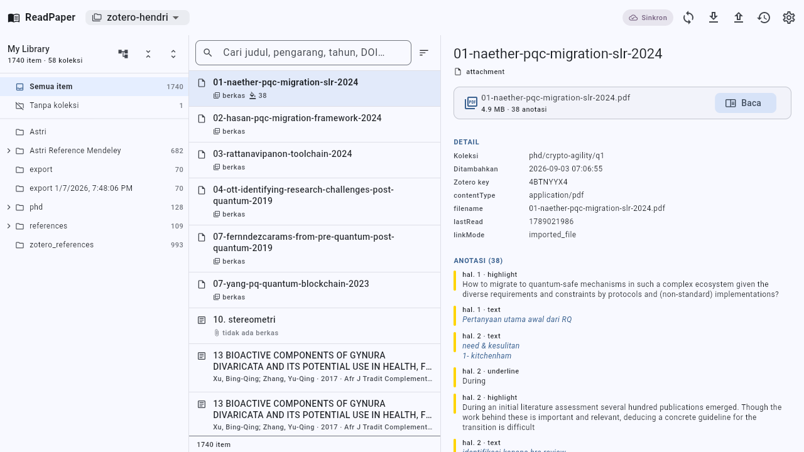
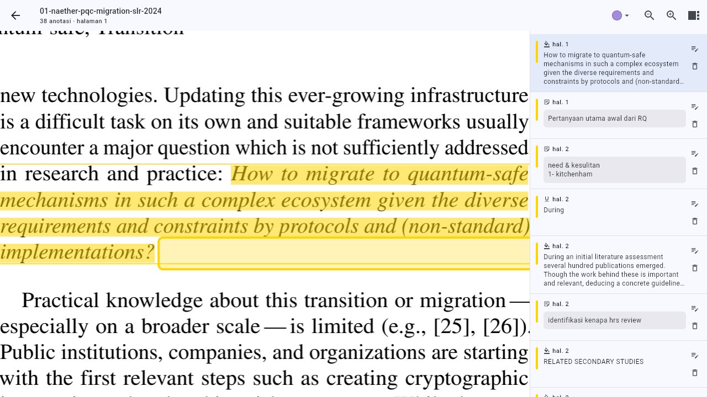

# ReadPaper

A Zotero-style paper reader for libraries synced to GitHub by the
[zotero-github-sync](https://github.com/situkangsayur/zotero-github-plugin) plugin.

Open your Zotero repository from GitHub, browse the collections the way Zotero
shows them, read the PDFs, and put **coloured markers** and **comments** on
specific passages — every change is written straight back into the Zotero files
and committed to git.

> The application interface is in Indonesian; this document describes the
> project in English.



## Download

**Android** — get the APK from the
[latest release](https://github.com/situkangsayur/readpaper/releases/latest):

| File | Platform | Size |
| --- | --- | --- |
| `readpaper-v0.1.6-arm64.apk` | Android 7.0+, arm64 · phone and tablet | 25 MB |

It is signed with a debug key, so Android warns about an unknown source on
install. Sync needs a GitHub fine-grained token with *Contents: read and write*
for the library repository.

**Linux desktop** — build from source, see [Running it](#running-it).

## What it does today

- **GitHub sync** — clone, fetch, pull, commit and push over **SSH** (with a
  per-profile private key) or **HTTPS** (personal access token), with a real
  percentage progress bar. A PDF added through GitHub shows up after a pull.
- **Lean clone** — a Zotero library is mostly PDFs, so only the metadata comes
  down first and each PDF is fetched when you open that paper. Measured on a
  real library of 1,740 items: **~23 MB in ~14 seconds**, against ~940 MB for a
  full clone. Opening one paper costs about 4 seconds.
- **Runs on Android too** — there is no `git` binary there, so the repository is
  *mirrored* through the GitHub REST API instead: the library metadata (~19 MB)
  is downloaded, the PDFs (~529 MB) stay on GitHub until a paper is opened.
  Annotations go back as real commits.
- **Switch repositories any time** — each profile owns its own clone directory,
  so moving back and forth never re-downloads one you already have.
- **Zotero collection structure** — a nested, expandable collection tree with
  per-collection counts, plus "all items", "unfiled", and the option to include
  the items of sub-collections.
- **Paper list** — title, authors, year, item type, and badges for attachments,
  annotations and notes; quick search and sorting.
- **Phone, tablet and desktop** — one pane on a phone, list beside the paper on
  a tablet in portrait, and collections beside both in landscape or on a
  desktop. Touch targets, row heights and the reader's side panel follow the
  device rather than the window alone.
- **PDF reader** — text selection, highlights and underlines in the eight Zotero
  palette colours, a comment per annotation, free-standing page notes
  (long press), and an annotation panel you can click to jump to a marker.
- **Round-trips with Zotero** — annotations are written into
  `items/<XX>/<KEY>.json` in exactly the shape the plugin writes (tab indents,
  sorted keys, `annotationPosition`, `annotationSortIndex`), and the
  `## Annotations` block of `notes/**.md` is kept in step. Adding one highlight
  means one new line in the note and one new block in the JSON, so diffs stay
  small.



What comes next is in [docs/backlog.md](docs/backlog.md): author search and
metadata detail (phase 2), EPUB and other ebook formats (phase 3), then the
remaining Android and distribution work (phase 4).

## Running it

Needs Flutter 3.41+ (developed against 3.44.5 / Dart 3.12). The Linux desktop
build also needs `clang`, `ninja-build`, `libgtk-3-dev`, `git` and `git-lfs`:

```bash
sudo apt install clang ninja-build libgtk-3-dev git git-lfs
flutter pub get
flutter run -d linux
```

For Android (needs a GitHub token with *Contents: read and write*):

```bash
flutter build apk --release --target-platform=android-arm64
```

On first launch, add a repository:

| Field | Example |
| --- | --- |
| Repository URL | `git@github.com:situkangsayur/zotero-hendri.git` |
| Transport | SSH (private key optional) or HTTPS + token. Android offers HTTPS only. |
| Clone folder | defaults to `~/.local/share/readpaper/repos/<owner>-<repo>` |

Then press **Ambil sekarang** ("fetch now"). The collections and the paper list
are ready as soon as the metadata is down.

## Marking up a paper

1. Open a paper and press **Baca** ("read") on its PDF attachment.
2. Select text on the page. An action bar appears at the bottom.
3. Pick a colour, then **Stabilo** (highlight), **Garis bawah** (underline) or
   **Komentar** (highlight with a comment).
4. Tap a marker on the page — or the pencil in the side panel — to change its
   colour or comment, or to delete it.

Every action becomes one commit. Turn on *push after saving an annotation* in
the profile to send each one to GitHub immediately; otherwise use the upload
button in the workspace bar to commit and push when you are ready.

## How it is put together

Feature-first, with `domain` / `data` / `presentation` separated inside each
feature:

```
lib/
  main.dart
  src/
    app/                     theme and the app widget
    core/                    constants, errors, utilities (paths, colours, Zotero keys)
    shared/providers/        Riverpod providers for repositories and backends
    features/
      library/               Zotero export parser and writer, collection tree, item list
      reader/                PDF reader, annotation geometry, annotation panel
      sync/                  GitBackend plus two implementations: the git CLI
                             (desktop) and the GitHub REST API (Android)
      settings/              repository profiles and credentials
      workspace/             orchestration: active repo, git status, loaded library
```

Two things are worth knowing before changing anything:

- **The export format is reproduced byte for byte.** `ZoteroJson.encodeFile`
  matches the plugin's output exactly — verified against all 1,740 item files of
  a real library. `children` is sorted by Zotero key, whole numbers are written
  without a trailing `.0`, and annotations that share a sort index keep creation
  order. Anything else turns a one-line change into a rewritten file.
- **`GitBackend` is the only seam between platforms.** Desktop shells out to
  `git`; Android speaks the GitHub git data API. Everything above that seam —
  the whole UI and `WorkspaceController` — is identical on both.

[docs/architecture.md](docs/architecture.md) has the layer rules, the data
format, the annotation coordinate system, and the measurements behind the lean
clone.

## Tests

```bash
flutter test
```

Two checks are kept out of that run because they need a real repository or the
network:

```bash
# Parses a real clone, and confirms every item file re-encodes byte for byte
# to what the plugin wrote. Skipped unless you point it at a clone.
READPAPER_TEST_REPO=~/.local/share/readpaper/repos/<owner>-<repo> \
  flutter test test/_real_repo_check.dart

# Exercises GitHubApiClient against the live GitHub API (public repo, no token).
flutter test test/_real_github_api_check.dart
```
