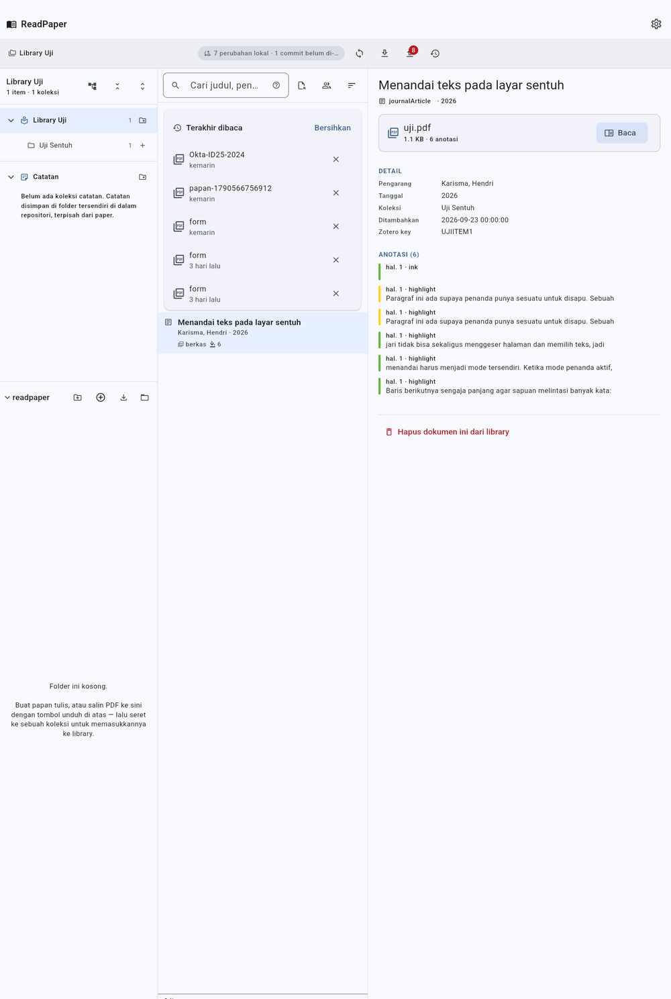
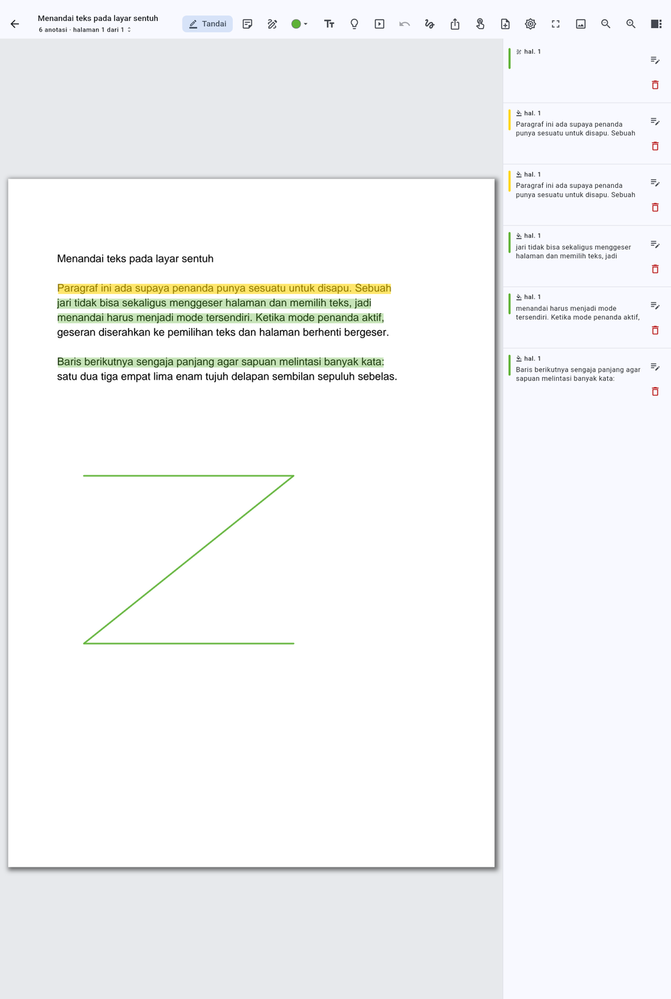
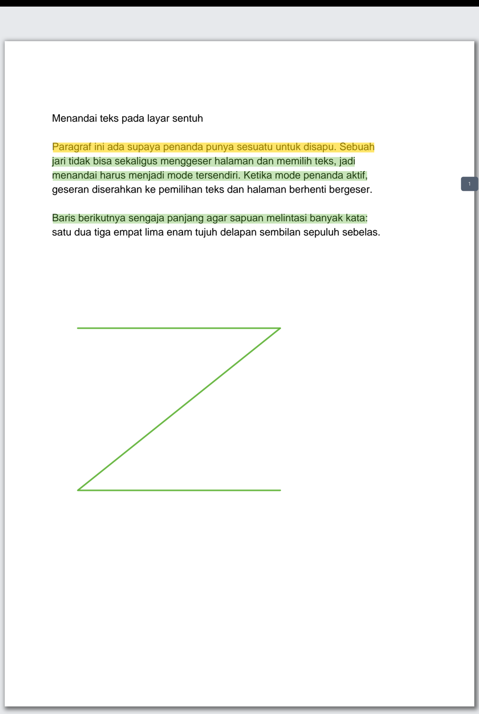
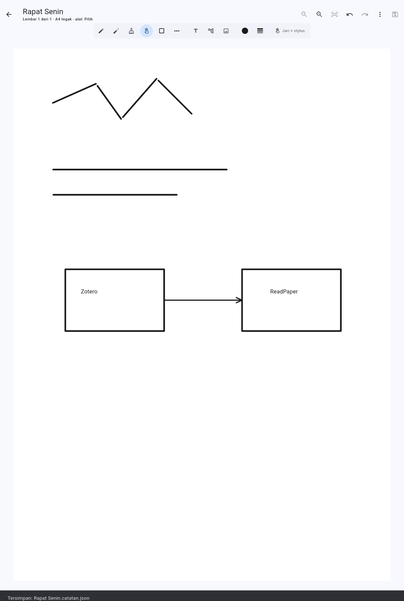
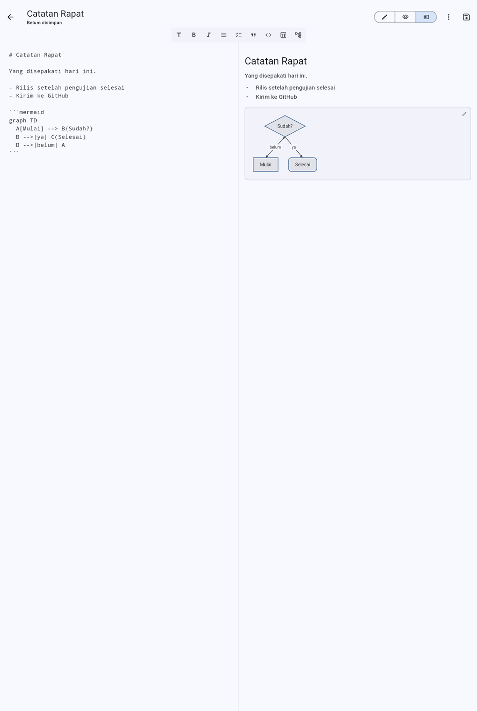

# ReadPaper

A Zotero-style paper reader for libraries synced to GitHub by the
[zotero-github-sync](https://github.com/situkangsayur/zotero-github-plugin) plugin.

Open your Zotero repository from GitHub, browse the collections the way Zotero
shows them, read the PDFs, and put **coloured markers** and **comments** on
specific passages — every change is written straight back into the Zotero files
and committed to git.

> The application interface is in Indonesian; this document describes the
> project in English.



*The collection tree has two roots: the Zotero library on top, and **Catatan**
(notes) below it — notes live in their own directory inside the repository,
outside the Zotero export.*

## Download

**Android** — get the APK from the
[latest release](https://github.com/situkangsayur/readpaper/releases/latest):

| File | Platform | Size |
| --- | --- | --- |
| `readpaper-<version>-arm64.apk` | Android 7.0+, arm64 · phone and tablet | 29 MB |

It is signed with a debug key, so Android warns about an unknown source on
install. Sync needs a GitHub fine-grained token with *Contents: read and write*
for the library repository.

**Linux desktop, x86-64** — three shapes, from the same release:

| File | For | Size |
| --- | --- | --- |
| `readpaper-<version>-linux-x64.tar.gz` | Anything, Arch and CachyOS included: unpack and run `./readpaper` | 16 MB |
| `readpaper_<version>_amd64.deb` | Debian 12+, Ubuntu 22.04+, Mint, Pop!_OS | 12 MB |
| `PKGBUILD` | Arch, CachyOS, Manjaro, EndeavourOS | — |
| `pasang-arch.sh` | Same distros: installs the `readpaper-bin` pacman package in one step | — |

```sh
# Debian and derivatives
sudo apt install ./readpaper_<version>_amd64.deb

# Arch and derivatives (CachyOS included): one step, as a normal user
curl -fsSL https://github.com/situkangsayur/readpaper/releases/latest/download/pasang-arch.sh | bash
# ...or from an unpacked tarball, offline: ./pasang-arch.sh   (remove: --hapus)
# ...or by hand: makepkg -si in the folder holding PKGBUILD

# Anywhere else
tar xzf readpaper-<version>-linux-x64.tar.gz
cd readpaper-<version>-linux-x64 && ./readpaper
```

It needs GTK 3.24 and the usual desktop libraries — nothing else. **No Java
runtime**: `path_provider_android` 2.3.0 started pulling in the `jni` FFI
plugin, which Flutter then builds for every platform, so the package is pinned
to 2.2.23 and `pubspec.lock` has no `jni` at all.

The packages are built **inside a Debian 12 container**
(`scripts/build-linux-in-debian12.sh`), not on the Ubuntu 24.04 development
machine: a binary built there installs on Debian 12 and then dies with
`undefined symbol: g_once_init_enter_pointer`. Every release is installed and
**actually run** under Xvfb in Debian 12, Ubuntu 22.04, Ubuntu 24.04 and Arch
containers by `scripts/test-linux-packages.sh` before it ships.

The desktop build exists because word processors do. Citation plugins for
OnlyOffice, LibreOffice and Word talk to ReadPaper running on the same machine,
so it has to be installable there first.

## What it does today

- **GitHub sync** — clone, fetch, pull, commit and push over **SSH** (with a
  per-profile private key) or **HTTPS** (personal access token), with a real
  percentage progress bar. A PDF added through GitHub shows up after a pull.
- **Lean clone** — a Zotero library is mostly PDFs, so only the metadata comes
  down first and each PDF is fetched when you open that paper. Measured on a
  real library of 1,740 items: **~23 MB in ~14 seconds**, against ~940 MB for a
  full clone. Opening one paper costs about 4 seconds.
- **Runs on Android too** — there is no `git` binary there, so the repository is
  *mirrored* through the GitHub REST API instead: the library metadata (~19 MB)
  is downloaded, the PDFs (~529 MB) stay on GitHub until a paper is opened.
  Annotations go back as real commits.
- **Switch repositories any time** — each profile owns its own clone directory,
  so moving back and forth never re-downloads one you already have.
- **Zotero collection structure** — a nested, expandable collection tree with
  per-collection counts, plus "all items", "unfiled", and the option to include
  the items of sub-collections.
- **Paper list** — title, authors, year, item type, and badges for attachments,
  annotations and notes; quick search and sorting.
- **Phone, tablet and desktop** — one pane on a phone, list beside the paper on
  a tablet in portrait, and collections beside both in landscape or on a
  desktop. Touch targets, row heights and the reader's side panel follow the
  device rather than the window alone.
- **PDF reader** — text selection, highlights and underlines in the eight Zotero
  palette colours, a comment per annotation, free-standing page notes
  (long press), and an annotation panel you can click to jump to a marker.
- **Round-trips with Zotero** — annotations are written into
  `items/<XX>/<KEY>.json` in exactly the shape the plugin writes (tab indents,
  sorted keys, `annotationPosition`, `annotationSortIndex`), and the
  `## Annotations` block of `notes/**.md` is kept in step. Adding one highlight
  means one new line in the note and one new block in the JSON, so diffs stay
  small.



*Highlights, ink and comments on the page; the panel on the right lists every
annotation on the document.*

### Presenting



*One page per screen, no neighbours peeking in. The bar at the bottom carries
page steps, zoom, fit-to-screen, the pen, undo, palm rejection, a blank sheet to
scribble on, saving, and the way out — all reachable without leaving the mode.*

### Notes: a notebook, not a picture



*Ink, 2D shapes, text and connectors that follow the objects they join. Paper is
A5 to A1, portrait or landscape, **per sheet**. Saved as `.catatan.json` — it can
be opened and edited again — and exported to Markdown and PDF.*

### Markdown with Mermaid



*Source on the left, preview on the right. Mermaid diagrams are drawn by the app
itself — no WebView, no network — and tapping one puts the cursor on its source.*

What comes next is in [docs/backlog.md](docs/backlog.md): handwriting
recognition is the large piece still open (phases 14 and 15), together with
renaming and deleting paper collections.

## Running it

Needs Flutter 3.41+ (developed against 3.44.5 / Dart 3.12). The Linux desktop
build also needs `clang`, `ninja-build`, `libgtk-3-dev`, `git` and `git-lfs`:

```bash
sudo apt install clang ninja-build libgtk-3-dev git git-lfs
flutter pub get
flutter run -d linux
```

For Android (needs a GitHub token with *Contents: read and write*):

```bash
flutter build apk --release --target-platform=android-arm64
```

On first launch, add a repository:

| Field | Example |
| --- | --- |
| Repository URL | `git@github.com:situkangsayur/zotero-hendri.git` |
| Transport | SSH (private key optional) or HTTPS + token. Android offers HTTPS only. |
| Clone folder | defaults to `~/.local/share/readpaper/repos/<owner>-<repo>` |

Then press **Ambil sekarang** ("fetch now"). The collections and the paper list
are ready as soon as the metadata is down.

## Marking up a paper

1. Open a paper and press **Baca** ("read") on its PDF attachment.
2. Select text on the page. An action bar appears at the bottom.
3. Pick a colour, then **Stabilo** (highlight), **Garis bawah** (underline) or
   **Komentar** (highlight with a comment).
4. Tap a marker on the page — or the pencil in the side panel — to change its
   colour or comment, or to delete it.

Every action becomes one commit. Turn on *push after saving an annotation* in
the profile to send each one to GitHub immediately; otherwise use the upload
button in the workspace bar to commit and push when you are ready.

## How it is put together

Feature-first, with `domain` / `data` / `presentation` separated inside each
feature:

```
lib/
  main.dart
  src/
    app/                     theme and the app widget
    core/                    constants, errors, utilities (paths, colours, Zotero keys)
    shared/providers/        Riverpod providers for repositories and backends
    features/
      library/               Zotero export parser and writer, collection tree, item list
      reader/                PDF reader, annotation geometry, annotation panel
      sync/                  GitBackend plus two implementations: the git CLI
                             (desktop) and the GitHub REST API (Android)
      settings/              repository profiles and credentials
      workspace/             orchestration: active repo, git status, loaded library
```

Two things are worth knowing before changing anything:

- **The export format is reproduced byte for byte.** `ZoteroJson.encodeFile`
  matches the plugin's output exactly — verified against all 1,740 item files of
  a real library. `children` is sorted by Zotero key, whole numbers are written
  without a trailing `.0`, and annotations that share a sort index keep creation
  order. Anything else turns a one-line change into a rewritten file.
- **`GitBackend` is the only seam between platforms.** Desktop shells out to
  `git`; Android speaks the GitHub git data API. Everything above that seam —
  the whole UI and `WorkspaceController` — is identical on both.

[docs/tech-stack.md](docs/tech-stack.md) is the single page that answers
"what is it made of, how is it laid out, and what can it do": the dependency
table and why each one is there, the layer rules, the patterns that repeat
across the codebase, and the feature list.

One thing it says up front, because it is easy to assume otherwise:
**ReadPaper has no Rust in it.** Every line of its own logic is Dart. The only
native code it ships is pdfium (C++, brought in by `pdfrx`) and the Flutter
engine itself. Rust lives in the sibling app, WritePaperTeX, where a crate
wraps Tectonic and libgit2 — Android has no TeX Live, so the TeX engine has to
travel inside the app.

[docs/architecture.md](docs/architecture.md) goes deeper on the data format,
the annotation coordinate system, desktop packaging, and the measurements
behind the lean clone.

## Tests

```bash
flutter test
```

Two checks are kept out of that run because they need a real repository or the
network:

```bash
# Parses a real clone, and confirms every item file re-encodes byte for byte
# to what the plugin wrote. Skipped unless you point it at a clone.
READPAPER_TEST_REPO=~/.local/share/readpaper/repos/<owner>-<repo> \
  flutter test test/_real_repo_check.dart

# Exercises GitHubApiClient against the live GitHub API (public repo, no token).
flutter test test/_real_github_api_check.dart
```

## Dokumentasi

The guides below are in Indonesian, like the rest of `docs/`:

- [docs/fitur.md](docs/fitur.md) — every feature in one or two sentences,
  grouped by area, with the Android/desktop differences and known limits.
- [docs/panduan-pengguna.md](docs/panduan-pengguna.md) — user guide: first
  setup and GitHub token, daily workflows (reading, marking up, presenting with
  a stylus, adding PDFs to collections, notes, sync), error messages and what
  they mean, and what not to do so the repository stays usable by Zotero.
- [docs/panduan-teknis.md](docs/panduan-teknis.md) — developer guide: setup,
  builds for Android/Linux/Windows, tests, sync and annotation internals, the
  stylus capture design, releases, conventions, and where to look when
  something breaks.

## Contributing

Patches are welcome, and so are bug reports from people who only use the app.
[CONTRIBUTING.md](CONTRIBUTING.md) has the short version: fork, branch, keep
`flutter analyze` clean and `flutter test` green, sign your commits off with
`-s`, open a pull request. Issues and the board live on
[GitHub](https://github.com/situkangsayur/readpaper/issues).

## License

ReadPaper is free software under the **GNU Affero General Public License,
version 3 or later** ([LICENSE](LICENSE)).

In plain terms: you may use it, read it, change it and sell it. What you may
not do is take it closed. Anyone you hand a copy to — or anyone who uses a
modified copy of it over a network — has the right to the corresponding source
under the same licence. That is deliberate: the point of this app is that it
keeps being something people can build on.

Two consequences worth knowing before you plan on them:

- Apple's App Store terms have long been treated as incompatible with the
  (A)GPL, so an iOS build could not be shipped there. Android, desktop and
  direct downloads are unaffected.
- The plugin API (once it exists) is intended to ship under a permissive
  licence so that third-party plugins may choose their own terms. That is
  tracked in the backlog and is not settled yet.

Third-party dependencies keep their own licences; all current ones are MIT or
BSD-3-Clause, which AGPL-3.0 accepts.
