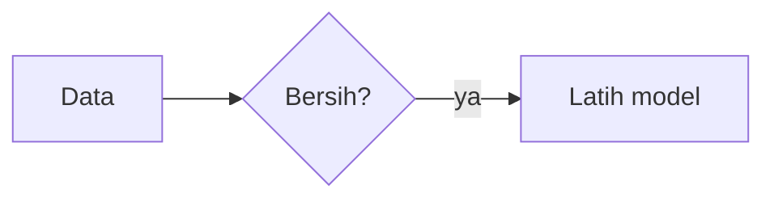

# Panduan pengguna

Panduan ini untuk yang memakai ReadPaper sehari-hari: memasang repositori,
membaca dan menandai paper, menyajikan di depan kelas, menulis catatan, dan
mengirim semuanya kembali ke GitHub tanpa merusak library Zotero. Daftar fitur
yang lebih ringkas ada di [fitur.md](fitur.md).

Nama tombol di bawah ditulis persis seperti di aplikasi. Kalau tombolnya
berupa ikon, namanya adalah keterangan yang muncul ketika ikon itu ditekan
lama (di tablet) atau ditunjuk tetikus (di desktop).

---

## 1. Sebelum mulai

ReadPaper membaca library Zotero yang sudah disinkronkan ke repositori GitHub
oleh plugin **zotero-github-sync**. Jadi yang harus ada lebih dulu:

1. Zotero di komputer dengan plugin itu terpasang, dan library-nya sudah
   pernah didorong ke sebuah repositori GitHub. Di repositorinya ada folder
   `zotero/<nama-library>/` berisi `collections.json` dan folder `items/`.
2. ReadPaper terpasang di perangkat: APK untuk Android, `.deb`/`.tar.gz`/
   `PKGBUILD` untuk Linux, atau zip portabel untuk Windows. Semuanya ada di
   halaman Releases repositori ReadPaper. Di **CachyOS, Arch, dan turunannya**
   cukup satu perintah sebagai pengguna biasa:
   `curl -fsSL https://github.com/situkangsayur/readpaper/releases/latest/download/pasang-arch.sh | bash`
   — atau `./pasang-arch.sh` dari folder tarball yang sudah dibongkar, tanpa
   internet. Ia memasang paket pacman `readpaper-bin`; hapus dengan
   `sudo pacman -R readpaper-bin`.
3. Di Linux dan Windows: `git` terpasang. Di Linux juga `git-lfs` kalau library
   memakai Git LFS (`sudo apt install git git-lfs`). Android tidak butuh git.

### Membuat token GitHub

Android selalu memakai token. Di desktop token dipakai kalau memilih HTTPS;
dengan SSH, kunci SSH yang dipakai.

Pakai **fine-grained token** — jenis token yang paling sempit, karena hanya
berlaku untuk repositori yang dipilih:

1. Di GitHub: **Settings → Developer settings → Personal access tokens →
   Fine-grained tokens → Generate new token**.
2. *Repository access*: **Only select repositories**, lalu pilih repositori
   library Zotero saja.
3. *Permissions → Repository permissions*: **Contents: Read and write**.
   (*Metadata: Read-only* ikut terpasang sendiri.) Tidak perlu izin lain.
4. Beri masa berlaku yang masuk akal, buat, lalu salin tokennya. GitHub hanya
   menampilkannya sekali.

Token dengan izin baca saja cukup untuk mengambil library, tetapi setiap
pengiriman akan gagal dengan *Akses ditolak. Token perlu izin "Contents: read
and write" untuk repositori ini.*

---

## 2. Penyiapan pertama

### Menambah repositori

Saat pertama dibuka, ReadPaper menampilkan **Belum ada repositori**. Tekan
**Tambah repositori**, lalu isi:

| Kolom | Isi |
|---|---|
| **URL repositori** | mis. `https://github.com/nama/zotero-saya.git` (atau `git@github.com:...` untuk SSH di desktop) |
| SSH / HTTPS | Android hanya HTTPS. Desktop boleh keduanya |
| **Nama tampilan** | nama yang muncul di aplikasi; terisi sendiri dari URL |
| **Username GitHub** dan **Personal access token** | untuk HTTPS. Token disimpan terpisah dari setelan lain |
| **Kunci privat SSH (opsional)** | desktop, untuk SSH. Kosongkan untuk memakai ssh-agent atau kunci bawaan |
| **Branch** | biasanya `main` |
| **Folder clone lokal** | desktop saja; bawaannya `~/.local/share/readpaper/repos/<pemilik>-<repo>` |
| **Identitas commit** (Nama, Email) | nama yang tercatat di commit; kosong berarti memakai konfigurasi git |
| **Unduh PDF hanya saat dibuka** | biarkan menyala. Hanya metadata yang diambil di awal |
| **Push otomatis setelah menyimpan anotasi** | menyala: setiap stabilo dan komentar langsung dikirim. Mati: dikirim sekaligus nanti |

Tekan **Simpan**.

### Mengambil library

Setelah profil disimpan, muncul kartu **Ambil library "nama"** (di desktop
dengan pilihan PDF dimatikan: **Clone "nama"**).

1. Kalau ragu soal jaringan atau token, tekan **Periksa koneksi** dulu. Di
   Android jawabannya menyebut akun yang terhubung dan sisa kuota GitHub.
2. Tekan **Ambil sekarang**. Kemajuannya tampil di kotak di bawah kartu.
3. Begitu selesai, pohon koleksi dan daftar paper langsung muncul. PDF belum
   ikut; masing-masing diunduh saat papernya dibuka.

Untuk library sekitar 1.700 item, pengambilan pertama di Android memakan ribuan
permintaan ke GitHub dan bisa beberapa menit. Kalau terputus, tombolnya berubah
jadi **Lanjutkan**, dan yang sudah tersimpan tidak diunduh ulang.

### Beberapa repositori

Repositori lain ditambahkan dari layar **Repositori** (ikon **Kelola
repositori**). Pindah repositori lewat nama library di bilah atas (**Ganti
library** / **Ganti repositori**) atau tombol **Jadikan aktif** di layar
Repositori. Tiap profil punya folder sendiri, jadi berpindah tidak mengunduh
ulang. Tema terang/gelap juga diatur di layar Repositori, dan nomor versi
aplikasi tertulis di bagian bawahnya — sebutkan nomor itu kalau melaporkan
masalah.

---

## 3. Membaca paper

1. Pilih koleksi di pohon kiri, lalu paper di daftar tengah.
2. Di panel detail, pada bagian lampiran:
   - **Baca** kalau PDF-nya sudah ada di perangkat;
   - **Unduh** kalau keterangannya *ada di GitHub, belum diunduh*. Setelah
     selesai, tombolnya menjadi **Baca**;
   - **LFS pull** (desktop) kalau keterangannya *pointer Git LFS — jalankan LFS
     pull*.
3. Paper yang pernah dibuka dilanjutkan di halaman terakhir, dan muncul di
   kartu **Terakhir dibaca** di atas daftar.

**Buku EPUB** dibuka di pembacanya sendiri — dari lampiran library, panel
berkas, daftar catatan, atau **Buka dengan** dari aplikasi lain. Di bilah atas:
**A−**/**A+** untuk ukuran huruf, tombol kontras untuk warna halaman, **Bagikan**,
dan **Daftar isi**. Berpindah bab lewat panah di bawah. Membuka buku yang sama
lagi melanjutkan di tempat terakhir. EPUB belum bisa distabilo.

Di dalam pembaca PDF:

- Ketuk **nomor halaman** di bilah atas untuk lompat ke halaman atau membuka
  **Daftar isi** berkas.
- **Mode baca — sembunyikan semua bilah** menghilangkan semua bilah. Keluar
  lewat tombol bulat **Keluar dari mode baca**.
- **Warna halaman** berganti Normal → Sepia → Redup → Balik warna.
- Ikon lampu: **Biarkan layar menyala selama membaca**.
- **Panel anotasi** (ikon dengan angka) membuka daftar semua anotasi; ketuk
  satu untuk melompat ke sana.

### Mencari paper

Ketik di kotak **Cari judul, pengarang, abstrak, DOI…**. Beberapa kata berarti
semuanya harus cocok. Untuk mempersempit, pakai nama bidang — tekan ikon
**Cara mempersempit pencarian** untuk daftarnya:

```
pengarang:hendri tahun:2024
judul:"deep learning" -tag:draf
koleksi:tesis jenis:book
```

Kalau nama pengarangnya tidak teringat persis, ikon **Telusuri berdasarkan
pengarang** membuka daftar semua nama beserta jumlah karyanya.

---

## 4. Menandai dan memberi komentar

Ada dua cara menandai teks.

**Memilih teks** (cara biasa, juga di desktop):

1. Tekan lama tepat di atas sebuah kata, lalu tarik pegangannya. Di desktop,
   seret tetikus.
2. Di bilah yang muncul, pilih warna, lalu **Stabilo**, **Garis bawah**, atau
   **Komentar** (stabilo beserta komentar). **Salin** menyalin teksnya.

**Mode Tandai** (lebih cepat di layar sentuh):

1. Tekan **Tandai** di bilah atas. Bilahnya berubah jadi **Menandai**.
2. Pilih warna, lalu sapukan jari di atas teks. Begitu jari diangkat, teksnya
   berwarna.
3. Tekan **Selesai** untuk kembali. Selama mode ini menyala, halaman tidak bisa
   digeser dan teks tidak bisa disalin.

Setelah sebuah anotasi tersimpan, muncul **Tersimpan** dengan tombol
**Urungkan** — satu ketukan untuk membatalkan sapuan yang salah baris.

Mengubah atau menghapus: ketuk anotasinya di halaman, atau pensil **Ubah
komentar / warna** di panel anotasi. Tong sampah menghapus, dengan konfirmasi.

**Catatan tempel**: tekan **Tempel catatan di halaman**, lalu ketuk tempatnya.

Setiap anotasi pada paper dari library langsung ditulis ke berkas item Zotero
dan di-commit. Ia belum ada di GitHub sampai dikirim (lihat bagian 9), kecuali
**Push otomatis** menyala.

---

## 5. Menulis dengan pena dan stylus

1. Tekan **Tulis atau gambar di halaman** (ikon pena). Muncul bilah pena berisi
   jumlah goresan, **Urungkan goresan terakhir**, **Buang semua goresan yang
   belum disimpan**, dan **Selesai**.
2. Pilih warna dan tebal. Mengganti warna di tengah jalan menyimpan coretan
   sebelumnya lebih dulu, jadi warnanya tidak ikut berubah.
3. Tulis. Tebalnya tetap selama satu gambar — anotasi tinta Zotero hanya
   menyimpan satu tebal. (Di papan tulis dan buku catatan, tebal mengikuti
   tekanan stylus.)
4. Tekan **Selesai**. Itu yang menyimpan gambar sebagai satu anotasi tinta.
   Berpindah ke halaman lain juga menyimpan coretan di halaman sebelumnya.

### Stylus saja

Kalau menulis dengan stylus sambil tangan bertumpu di layar, nyalakan
**Stylus saja** (ikon tangan dicoret). Akibatnya:

- hanya stylus yang menggambar; telapak tangan tidak meninggalkan garis;
- jari tetap menggeser dan mencubit halaman, jadi dokumen tetap bisa digulir
  sambil menulis;
- sentuhan yang datang saat stylus sedang dekat layar, sedang menulis, atau
  baru diangkat (kurang dari sekitar satu detik), atau yang bidangnya selebar
  telapak, dianggap telapak dan tidak menggeser halaman.

Pilihan ini disimpan, jadi cukup dinyalakan sekali per perangkat. Di desktop,
tetikus tetap dihitung sebagai stylus supaya layar tanpa stylus tetap bisa
dipakai.

### Memindah dan memutar

Tinta, tanda tangan, dan catatan yang sudah ditaruh bisa diketuk lalu digeser
(**Seret untuk memindahkan**), diubah ukurannya, atau diputar lewat pegangan di
sudut bingkainya. Stabilo dan garis bawah tidak bisa diputar.

**Ke halaman lain.** Seret anotasi yang terpilih ke halaman lain. Selama
diseret, label di sebelah jari menyebut halaman tempat ia akan jatuh. Tahan jari
di dekat tepi atas atau bawah layar dan halaman akan bergulir sendiri. Untuk
halaman yang jauh, pakai **Ke halaman…** di bilah bawah lalu ketik nomornya.

**Salin, potong, tempel.** Selama sebuah anotasi terpilih, bilah di bawah
menampilkan **Salin**, **Potong**, dan **Ke halaman…**. Buka halaman tujuan,
lalu tekan **Tempel di halaman N**. Tempelan muncul di posisi yang sama dengan
aslinya, dan langsung bisa diseret ke tempat yang tepat. Di desktop pakai
Ctrl+C, Ctrl+X, Ctrl+V, dan Delete untuk menghapus. Yang disalin tetap ada
sampai diganti, jadi bisa ditempel juga di paper lain. Tombol **×** di bilah
itu mengosongkannya. Salah pindah atau salah tempel bisa diurungkan seperti
biasa.

### Mengisi formulir dan menandatangani

- **Isi teks di halaman — untuk mengisi formulir** (ikon Tt), lalu ketuk tempat
  teksnya.
- **Tanda tangan**: tulis di papan yang muncul, tekan **Pakai**, lalu ketuk
  halaman di tempat tanda tangannya ditaruh.

---

### Salah menulis

- **Penghapus** (tombol berlabel "Penghapus" di bilah pena): sapukan di atas coretan yang
  salah. Goresan yang tersentuh dibuang utuh, termasuk coretan yang sudah
  tersimpan. **Urungkan** mengembalikannya. Ujung penghapus stylus langsung
  menghapus tanpa perlu menyalakan sakelar.
- **Urungkan** dan **Ulangi** ada di bilah atas, di bilah pena, dan di bilah
  bawah saat menyajikan. Di desktop: **Ctrl+Z** untuk urungkan, **Ctrl+Shift+Z**
  atau **Ctrl+Y** untuk ulangi. Selama pena aktif, keduanya bekerja pada
  goresan yang belum disimpan lebih dulu.
- **Tinta putih** (lingkaran putih di samping pemilih warna; ketuk lagi untuk
  kembali ke warna sebelumnya) untuk menutup sesuatu di halaman putih. Penghapus tetap cara
  yang lebih bersih: tinta putih ikut tersimpan dan terlihat di atas halaman
  yang tidak putih.

## 6. Menyajikan kuliah atau presentasi

Alur yang dipakai untuk mengajar dari sebuah PDF, sambil mencoret dengan
stylus:

1. Buka PDF-nya: dari library (**Baca**), atau PDF lepas lewat **Buka PDF dari
   perangkat ini** atau panel berkas.
2. Tekan **Sajikan — satu halaman penuh layar**. Semua bilah atas hilang, dan
   kendali pindah ke satu bilah di bawah.
3. Ganti halaman dengan ketuk tepi kiri/kanan, geser ke samping, atau
   **Halaman sebelumnya** / **Halaman berikutnya**. **Pas satu halaman ke
   layar** mengembalikan zum.
4. Untuk mencoret, tekan **Coret-coret di halaman**. Bilah bawah berganti jadi
   tebal, warna, **Urungkan goresan terakhir**, buang, **Stylus saja**, dan
   **Selesai**. Selama pena aktif, ketuk tepi tidak mengganti halaman — pakai
   tombol halaman.
5. Butuh ruang kosong untuk menjelaskan? **Tambah lembar kosong untuk
   dicoreti**, lalu pilih **1 halaman setelah halaman n** (atau 2, 5), atau di
   akhir dokumen. Aplikasi langsung membuka lembar kosong itu.
6. Tekan **Selesai** setelah selesai mencoret satu halaman, supaya coretannya
   tersimpan sebagai anotasi.
7. Keluar dengan **Keluar dari mode menyajikan**.

### Menyimpan coretan kuliah

Ada dua jenis hasil, dan keduanya berbeda:

- **Coretan sebagai anotasi.** Pada paper dari library, setiap **Selesai**
  menulis coretan ke item Zotero dan meng-commit-nya. Kirim lewat **Kirim
  perubahan** seperti anotasi lain. Coretan ini bisa disunting lagi dan terlihat
  di Zotero.
- **PDF jadi.** Tombol simpan di bilah bawah (**Simpan sebagai PDF**; di
  desktop **Simpan ke berkas ini** untuk PDF lepas) menghasilkan PDF berisi
  halaman aslinya dengan anotasi di atasnya. Teks, tabel, dan gambarnya tetap
  seperti aslinya: bisa dicari dan disalin. Stabilo dan coretan ditambahkan
  sebagai garis dan bidang vektor, isian Tt sebagai teks, dan komentar sebagai
  catatan tempel yang bisa dibuka di pembaca PDF mana pun. Goresan yang belum
  selesai ikut disimpan lebih dulu.
  Di Android, pilih **Folder kerja** supaya berkasnya muncul di panel berkas.
  Halaman kosong yang ditambahkan **hanya ikut lewat cara ini** — penambahan
  halaman tidak mengubah berkas aslinya.

Untuk PDF lepas, hanya cara kedua yang ada: anotasinya hilang kalau pembaca
ditutup tanpa menyimpan. Kalau PDF kuliah itu ingin disimpan di library, lihat
bagian berikut.

---

## 7. Memasukkan PDF ke sebuah koleksi

### Dari pembaca

1. Buka PDF lepasnya.
2. Tekan **Simpan dan bagikan** → **Tambahkan ke koleksi…**.
3. Pilih koleksi tujuan, atau:
   - **Tanpa koleksi** — masuk library tanpa koleksi;
   - **Koleksi baru…** — buat koleksi di akar library;
   - ikon map di kanan sebuah koleksi (**Sub-koleksi baru di dalam …**) — buat
     sub-koleksi di dalamnya.
4. Kalau membuat koleksi, isi namanya lalu **Buat**. Nama tidak boleh kembar
   di tempat yang sama, dan tidak boleh memuat garis miring.
5. Periksa **Judul dokumen**, lalu **Tambahkan**. Muncul *Masuk library sebagai
   KUNCI*.

Yang dimasukkan adalah berkas yang sedang tampil, termasuk halaman kosong yang
sudah ditambahkan. Anotasi yang belum disimpan **tidak ikut**; simpan PDF-nya
dulu kalau coretannya ingin terbawa.

### Dengan menyeret

Di panel berkas, seret sebuah PDF ke koleksi di pohon. Barisnya menyala saat
berkas melayang di atasnya; melepas di "Semua item" berarti masuk tanpa
koleksi. Akar paper hanya menerima PDF.

### Koleksi baru dari pohon

Ikon **Koleksi paper baru** di samping nama library membuat koleksi di akar;
ikon **Sub-koleksi baru di sini** pada sebuah baris membuat sub-koleksi.

### Banyak repositori

Ketuk nama repositori di kiri atas untuk berpindah. Setiap repositori menyebut
isinya: jumlah item dan koleksi, ukuran di disk, lampiran yang sudah diunduh,
dan berapa perubahan yang belum terkirim. **Kelola repositori…** di menu yang
sama membuka daftar lengkapnya, dan dari sana repositori baru ditambahkan.

Untuk memindah atau menyalin ke repositori lain:

- **Satu paper:** di panel detailnya, **Pindahkan atau salin ke repositori
  lain…**.
- **Satu koleksi beserta isinya:** ⋮ pada koleksi → **Pindahkan atau salin ke
  repositori lain…**.
- **Satu catatan:** tekan lama atau menu catatannya di daftar catatan →
  **Pindahkan atau salin ke repositori lain…**. Koleksi catatan lewat ⋮-nya.
  Catatan mendarat di akar Catatan repositori tujuan, atau di koleksi catatan
  yang dipilih di sana.

Pilih repositori tujuan, koleksi di sana, lalu **Pindahkan** atau **Salin**.
Anotasi, catatan, dan PDF ikut. Kedua repositori mendapat commit sendiri;
kirim perubahannya di masing-masing repositori. Kalau PDF sebuah paper belum
diunduh ke perangkat ini, tidak ada yang dipindah: buka papernya sekali
supaya PDF-nya terunduh (di desktop: LFS pull), lalu ulangi.

### Ganti nama, pindahkan, dan hapus

Tombol **⋮** di setiap koleksi, paper maupun catatan, membuka **Ubah nama**,
**Pindahkan ke…**, dan **Hapus koleksi**. Menu yang sama juga terbuka dengan
tekan lama.

- **Ubah nama** dan **Pindahkan** menjaga kunci koleksinya, jadi paper di
  dalamnya tetap anggota dan Zotero tetap mengenalinya. Koleksi tidak bisa
  dipindah ke dalam sub-koleksinya sendiri.
- **Hapus koleksi** tidak menghapus paper. Paper hanya dilepas dari koleksi
  itu, sama seperti di Zotero. Kalau koleksinya punya sub-koleksi, pilih
  **Hapus semuanya** atau **Sub-koleksi naik** satu tingkat.

Di **panel berkas**, tombol ⋮ di baris folder membuka **Ganti nama** dan
**Hapus folder**. Hapus menyebut berapa berkas yang ikut terhapus. Folder kerja
itu sendiri tidak bisa dihapus dari sana.

### Ekspor ke BibTeX untuk LaTeX

Tombol **⋮** di koleksi paper → **Ekspor ke BibTeX (.bib)**. Berkas
`<nama koleksi>.bib` ditulis ke folder kerja dan bisa langsung dibagikan, mis.
ke WritePaperTeX atau Overleaf. Untuk satu paper saja, buka panel detailnya
lalu **Salin BibTeX**; kuncinya ikut disebut di pesan.

Kunci sitasi tidak berubah ketika diekspor ulang, jadi `\cite{…}` di naskah
tetap benar. Kalau di Zotero sudah memakai Better BibTeX, kuncinya sama dengan
di sana (diambil dari baris `Citation Key:` di kolom Extra). Kalau tidak,
kuncinya dibentuk dari pengarang pertama, tahun, dan kata judul pertama, mis.
`mcclean2018barren`. Yang kembar diberi akhiran `a`, `b`, dan seterusnya.

### Penting untuk Android

Di Android, item Zotero dan koleksinya terkirim ke GitHub, tetapi **PDF-nya
tidak**. ReadPaper di Android tidak pernah mengirim lampiran lewat API GitHub
(alasannya di bagian 11). Pesan setelah commit akan menyebut *lampiran
dilewati (kirim lewat git di komputer)*. PDF-nya tetap ada di tablet dan bisa
dibaca di sana, tetapi perangkat lain akan melihat item tanpa berkas sampai
PDF itu dimasukkan dari komputer. Untuk PDF yang harus tersedia di mana-mana,
masukkan dari ReadPaper desktop atau dari Zotero.

---

## 8. Catatan, papan tulis, dan buku catatan

Semua catatan tinggal di akar **Catatan** di pohon koleksi, bukan di koleksi
paper. Kalau akar Catatan masih kosong, buat koleksinya dulu lewat ikon
**Koleksi catatan baru**.

**Catatan baru** (setelah memilih sebuah koleksi catatan, di panel tengah):

- **Buku catatan baru** — dokumen berlembar dengan pena, bangun, teks,
  gambar, dan diagram;
- **Catatan Markdown baru** — langsung terbuka di penyunting Markdown;
- **Tambah catatan dari berkas** — PDF, gambar, Markdown, atau berkas lain.

Menu **Tindakan** pada sebuah catatan berisi **Ubah judul**, **Pindahkan ke
koleksi**, dan **Hapus catatan** (berkasnya ikut terhapus). Catatan juga bisa
diseret antar koleksi catatan di pohon.

**Papan tulis** dibuat dari panel berkas: **Buat baru di folder ini → Papan
tulis**, pilih Tegak atau Mendatar. Hasilnya bisa **Simpan PDF** ke folder kerja,
atau **Simpan sebagai catatan** — untuk yang kedua, pilih dulu koleksi di bawah
akar Catatan; kalau yang terpilih koleksi paper, aplikasi menolak sambil
menjelaskan.

**Buku catatan**:

1. Pilih alat di bilah bawah: **Pena**, **Hapus goresan**, **Hapus sebagian**,
   **Pilih**, bangun, **Hubungkan dua benda**, **Teks**, **Diagram**,
   **Gambar**.
2. Alat penempel memberi tahu langkah berikutnya, misalnya *Ketuk lembar untuk
   menaruh teks*. Untuk penghubung: ketuk benda pertama, lalu benda kedua.
3. Benda yang baru ditaruh langsung terpilih: bisa digeser, diubah ukuran,
   diputar, diganti warna dan **Kepekatan**-nya.
4. Dengan alat **Pilih**, seret di ruang kosong untuk menarik kotak; semua yang
   tersentuh kotaknya terpilih dan bisa dihapus sekaligus.
5. Ukuran kertas (A5–A1) dan arahnya ada di depan bilah bawah. **Lembar kosong
   baru**, **Sisipkan halaman PDF sebagai lembar**, dan **Hapus lembar ini** ada
   di navigasi lembar.
6. Sakelar di ujung bilah: **Jari + stylus** atau **Stylus saja**.
7. **Simpan dan bagikan** → **Simpan sebagai Markdown**, **Simpan sebagai PDF**,
   atau **Simpan ke koleksi catatan**.
8. Seluruh PDF bisa dijadikan buku catatan dari pembaca: **Simpan dan bagikan**
   → **Jadikan buku catatan**. Tiap halaman jadi alas satu lembar, ditambah
   satu lembar kosong di belakang. Hasilnya mendarat di folder kerja, dan PDF
   aslinya tidak disentuh.

**Markdown**: tombol **Sunting**, **Pratinjau**, **Keduanya** di bilah atas,
tombol sisip di bawah. Diagram ditulis sebagai blok kode `mermaid` dengan
`graph` atau `flowchart`:

````

````

Mengetuk diagram di pratinjau membawa kursor ke sumbernya. **Lainnya → Simpan
sebagai PDF** menulis PDF dengan teks yang tetap bisa dicari.

Catatan yang diubah di-commit sendiri dengan pesan *Ubah catatan: judul*, dan
— berbeda dari PDF lampiran — **ikut terkirim dari Android**, karena tinggal
di `catatan/`, bukan di folder lampiran Zotero.

---

## 9. Sinkronisasi

Bilah atas punya tiga tombol (di layar sempit, satu menu **Sinkronisasi**):

| Tombol | Yang dilakukan |
|---|---|
| **Periksa perubahan di remote** | menanyakan GitHub apakah ada commit baru; tidak mengubah apa pun |
| **Tarik perubahan** (atau **Tarik n commit baru**) | mengambil perubahan dari GitHub dan membaca ulang library |
| **Kirim perubahan ke GitHub** | membuat commit (kalau perlu) lalu mengirimnya |

Keping di sebelahnya menunjukkan keadaan: sinkron, jumlah perubahan lokal, atau
langkah yang sedang berjalan beserta persennya.

**Kebiasaan yang aman**: tarik dulu, baru kirim. Kalau GitHub sudah maju sejak
terakhir menarik, pengiriman ditolak dengan *GitHub sudah punya commit lebih
baru. Tarik perubahan dulu, lalu kirim ulang.* ReadPaper tidak pernah memaksa
menimpa.

**Mengirim**:

1. Tekan **Kirim perubahan ke GitHub**.
2. Kalau ada perubahan yang belum di-commit, muncul **Kirim perubahan** dengan
   **Pesan commit** (bawaannya *Perbarui anotasi dari ReadPaper*). Ganti kalau
   perlu, lalu **Commit & kirim**.
3. Kalau semua perubahan sudah jadi commit, langsung dikirim tanpa bertanya.

**Detail sinkronisasi** (ikon jam) menampilkan tab **Perubahan**, **Riwayat**,
dan **Log git**. Lihat di sana kalau sesuatu terasa macet.

### Arti pesan setelah mengirim

| Pesan | Artinya | Yang dilakukan |
|---|---|---|
| *Terkirim: n berkas* | semua sampai | — |
| *Tidak ada yang perlu dikirim* | antrean kosong, atau isinya sudah sama dengan GitHub | — |
| *n berkas terkirim; m berkas ditolak GitHub dan tetap menunggu: nama… alasan* | sebagian besar sampai; berkas yang disebut ditolak GitHub, dengan alasan dari GitHub sendiri | lihat nama dan alasannya. Biasanya berkas terlalu besar. Berkas itu tetap di antrean, tetapi tidak menahan yang lain dan tidak diunggah ulang selama isinya tidak berubah |
| *... lampiran dilewati (kirim lewat git di komputer)* | Android tidak mengirim PDF lampiran | kirim PDF-nya lewat git atau Zotero di komputer |
| *Antrean hanya berisi lampiran; tidak ada yang bisa dikirim lewat jalur ini.* | sama, dan tidak ada perubahan lain | sama |
| *Berkasnya n MB, di atas batas 100 MB …* | batas API GitHub untuk satu berkas | kirim lewat git biasa di komputer, atau simpan di luar repositori |
| *GitHub meminta pengiriman diperlambat …* | batas kecepatan sekunder GitHub | tunggu beberapa menit, kirim lagi |

---

### Bila perangkat lain mengubah berkas yang sama

Laptop dan tablet sering mengubah berkas yang sama di waktu yang berdekatan,
misalnya keduanya membuat koleksi catatan. Saat menarik perubahan, ReadPaper
menyatukannya sendiri:

- **Koleksi, item catatan, dan item Zotero beserta anotasinya** digabung per
  benda. Koleksi yang dibuat di dua perangkat sama-sama ada, dan anotasi dari
  keduanya sama-sama tersimpan. Kalau satu kolom diubah di dua tempat sekaligus,
  yang dari perangkat ini menang. Hasilnya dikirim pada pengiriman berikutnya.
- **Catatan Markdown dan berkas lain milik Anda** tidak ditimpa. Versi di
  perangkat ini tetap, dan versi dari GitHub disimpan di sebelahnya sebagai
  *"(versi GitHub tanggal)"*.
- **Berkas turunan di folder Zotero**, misalnya catatan yang ditulis plugin,
  mengikuti versi GitHub, karena plugin menulisnya ulang dari datanya.

Pesan pull menyebut apa yang digabung, misalnya *"Digabung otomatis:
koleksi.json"*. Kalau dua koleksi bernama sama muncul setelahnya, itu karena
keduanya memang dibuat terpisah di dua perangkat. Hapus salah satunya.

## 10. Masalah dan pertanyaan

**Pull di desktop gagal dengan "It seems that there is already a rebase-merge
directory".** Ini sisa versi 0.23.7 ke bawah: pull yang bentrok berhenti di
tengah dan tidak pernah diselesaikan. Sejak 0.23.8, pull atau simpan anotasi
berikutnya memulihkannya sendiri. Keadaan lamanya dicadangkan di
`refs/readpaper/cadangan/…` di repositori itu, lalu perubahannya digabung.
Cukup perbarui ReadPaper, lalu tekan **Tarik** sekali.


**"Akses ditolak. Token perlu izin "Contents: read and write" untuk repositori
ini."** Token hanya boleh membaca, atau tidak mencakup repositori ini. Buat
token baru (bagian 1) dan ganti di **Ubah profil**.

**"Token GitHub ditolak. Periksa token di profil repositori."** Token salah
ketik, dicabut, atau kedaluwarsa.

**"Repositori atau berkas tidak ditemukan. Untuk repositori privat, token harus
punya akses ke repositori tersebut."** Periksa URL, dan pastikan repositorinya
dipilih di *Repository access* token.

**"Kuota permintaan GitHub habis…"** GitHub membatasi 5.000 permintaan per jam
per token. Pengambilan pertama library besar di Android bisa menghabiskannya.
Tunggu sekitar satu jam lalu tekan **Lanjutkan**.

**"Koneksi ke GitHub terputus dan tidak pulih setelah 3 percobaan. Unduhan bisa
dilanjutkan dari tempatnya berhenti."** Jaringan putus berulang. Tekan
**Lanjutkan** setelah jaringan stabil; yang sudah tersimpan tidak diunduh lagi.

**"Berkas rusak saat diunduh: …"** Unduhan terpotong. Jalankan lagi.

**"Direktori tujuan sudah berisi berkas. Hapus atau pilih lokasi lain."**
Folder clone sudah dipakai sesuatu. Di desktop, pilih **Folder clone lokal**
lain di profil.

**"Perintah git tidak ditemukan di sistem…"** (Linux) Pasang
`sudo apt install git git-lfs`. Di Windows pesannya *Backend sinkronisasi tidak
tersedia di perangkat ini.* — pasang Git for Windows.

**"SSH ditolak: kunci tidak diterima GitHub…"** / **"Autentikasi HTTPS gagal:
token kosong atau tidak berlaku."** Periksa kunci atau token di profil.

**"Ada konflik saat menggabungkan perubahan. Selesaikan konflik di repo
lokal."** (desktop) Berkas yang sama diubah di dua tempat. ReadPaper belum bisa
membantu menyelesaikannya; buka folder clone di terminal dan selesaikan dengan
git.

**"Library tidak terbaca"** / **"Tidak menemukan ekspor Zotero di repositori
ini…"** Repositorinya bukan hasil plugin, atau ekspornya belum pernah didorong.
Pastikan ada `zotero/<library>/collections.json`, lalu **Pull**.

**"Masih ada perubahan yang belum dikirim ke GitHub. Kirim dulu, baru ambil
ulang."** Muncul saat menekan **Ambil ulang** di detail sinkronisasi. Mengambil
ulang menghapus folder lokal, jadi ditolak selama ada yang belum terkirim.

**"Anotasi tidak tersimpan: …"** Penanda tampil tetapi tidak tertulis ke berkas.
Alasannya disebut di belakang titik dua.

**"Tidak ada teks terpilih — tekan lama tepat di atas sebuah kata"** Tekan lama
jatuh di spasi antar kata. Ulangi tepat di atas kata.

**"Dokumen ini tidak mengizinkan penyalinan"** PDF-nya dikunci pembuatnya.

**"Catatan ini ditulis versi ReadPaper yang lebih baru…"** Perbarui aplikasinya.
Berkasnya sengaja tidak dibuka supaya tidak tersimpan balik dalam keadaan rusak.

**"Gambar itu tidak bisa dibaca dari tempatnya. Salin dulu ke folder kerja."**
Beberapa penyedia berkas Android tidak menyerahkan jalurnya. Pakai **Salin
berkas ke sini** di panel berkas, lalu ambil dari sana.

**Stylus kadang tidak menulis, atau halaman bergeser saat tangan mendarat.**
Nyalakan **Stylus saja**. Kalau masih terjadi di versi lama, perbarui:
beberapa sebabnya baru diperbaiki pada 2026-09-29 dan 2026-10-03.

**Tombol Unduh tidak muncul, keterangannya "berkas belum diunduh".** Item itu
mengaku punya lampiran, tetapi berkasnya tidak ada di GitHub — misalnya PDF yang
dimasukkan dari Android dan belum pernah dikirim dari komputer.

**Desktop: memasukkan PDF ke koleksi gagal dengan pesan git "The following
paths and/or pathspecs matched paths that exist outside of your sparse-checkout
definition".** Sudah diperbaiki di 0.23.7. Kalau masih muncul, git di komputer
itu terlalu tua (butuh 2.34 ke atas); perbarui git-nya, atau di terminal
jalankan `git -C <folder clone> add --sparse -A` lalu kirim lagi dari ReadPaper.

**Apakah anotasi saya terlihat di Zotero?** Ya, setelah dikirim ke GitHub dan
plugin di Zotero menariknya. Formatnya sama persis dengan yang ditulis plugin.

**Apakah PDF asli diubah oleh stabilo dan coretan?** Tidak. Anotasi disimpan di
berkas item Zotero. Lampiran paper dari library tidak pernah ditimpa; menyimpan
PDF-nya selalu menghasilkan berkas baru. Hanya PDF lepas di desktop yang bisa
ditimpa lewat **Simpan ke berkas ini**, dan itu pun menyalin yang asli lebih dulu.

---

## 11. Yang jangan dilakukan

ReadPaper berbagi repositori dengan Zotero. Plugin `zotero-github-sync` menulis
isi folder `zotero/` bita per bita, dan berkas yang tidak dikenalnya di sana
bisa membuat impor ke Zotero gagal. Karena itu:

- **Jangan menaruh berkas sendiri di dalam folder repositori**, terutama di
  `zotero/`. Di desktop ReadPaper meng-commit **semua** yang berubah di folder
  clone (`git add .`), dan di Android semua berkas di luar folder lampiran ikut
  terkirim. Berkas kerja tempatnya di **folder kerja**, yang berada di luar
  repositori.
- **Catatan ke akar Catatan, paper ke akar paper.** Aplikasi menolak yang
  salah tempat, tetapi jangan mengakalinya dengan menyalin berkas ke folder
  `zotero/` dengan tangan.
- **Paper dari library selalu disimpan sebagai PDF baru**, tidak menimpa
  lampirannya. Sampai versi 0.23.4, di desktop pilihan **Simpan ke berkas ini**
  masih muncul untuk paper library dan menimpa lampiran beserta salinan
  `<nama>.asli.pdf` di dalam struktur Zotero. Kalau pernah terjadi, kembalikan
  berkas itu lewat git sebelum mengirim perubahan.
- **Jangan mengirim PDF besar lewat Android.** Memang tidak akan terkirim, dan
  tidak perlu dicoba. PDF masuk lewat Zotero atau git di komputer.
- **Jangan menghapus atau menggabungkan duplikat dari ReadPaper** kecuali
  benar-benar yakin. Layar duplikat sengaja hanya menunjukkan; penggabungan
  dikerjakan di Zotero.
- **Jangan menyunting `collections.json` atau berkas item dengan tangan** dari
  editor teks. Format tab dan urutan kuncinya harus persis, dan ReadPaper serta
  plugin sama-sama menjaganya.
- **Jangan menghapus folder `.readpaper/` di salinan repositori Android.** Di sana
  tercatat dari commit mana mirror berasal dan apa yang menunggu dikirim.
  Tanpanya perangkat tidak tahu lagi mana yang sudah terkirim.
- **Jangan menekan "Ambil ulang" selagi ada perubahan yang belum terkirim.**
  Aplikasi menolaknya, tetapi alasannya patut diingat: folder lokal dihapus.

---

## 12. Tips

- Nyalakan **Push otomatis setelah menyimpan anotasi** kalau jaringannya
  stabil dan hanya satu perangkat yang menulis. Matikan kalau sering offline:
  perubahan menumpuk sebagai commit lokal dan dikirim sekaligus.
- Menandai banyak? Pakai mode **Tandai**, bukan pilih-lalu-tekan.
- Sebelum mengajar, buka PDF-nya sekali dalam mode menyajikan untuk memastikan
  sudah terunduh — mengunduh di depan kelas memakan waktu.
- Panel berkas bisa dilipat dengan mengetuk kepalanya ketika tidak sedang
  memasukkan berkas.
- Di Android, berkas dari aplikasi lain paling mudah masuk lewat **Salin berkas
  ke sini** di panel berkas, atau "Buka dengan → ReadPaper".
- Simpan PDF hasil suntingan ke **Folder kerja**, bukan "Tempat lain…", supaya
  berkasnya muncul di panel berkas dan bisa diseret ke koleksi.
